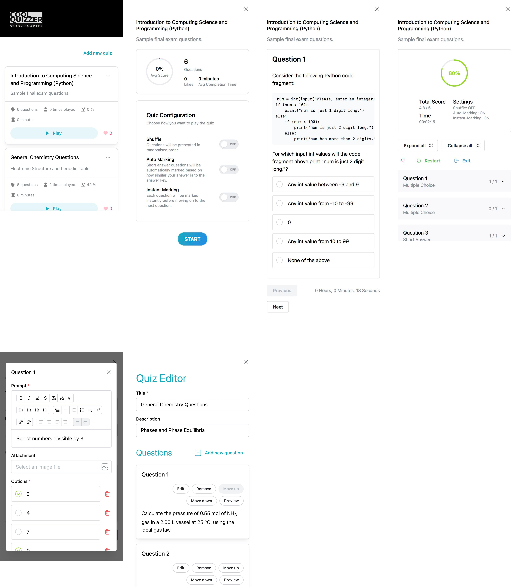

# Cool Quizzer
This project was created to demonstrate design and representation of quiz data using Object Oriented Programming.

>Live demo available [here](https://cool-quizzer-cdyocxqala-uc.a.run.app/) :sparkles:



## Teckstack
* [](https://reactjs.org/)
* [](https://www.typescriptlang.org/)
* [](https://mantine.dev/)
* [](https://expressjs.com/)
* [](https://firebase.google.com/)
* [](https://www.docker.com/)
* [](https://cloud.google.com/)

## Frontend
### Local Installation (requires working backend endpoints or backend running locally)
Create an .env file at the root directory **/cool-quizzer-client** and include the following:
```
REACT_APP_FILE_SERVICE_ENDPOINT="<YOUR_ENDPOINT>"
REACT_APP_QUIZ_SERVICE_ENDPOINT="<YOUR_ENDPOINT>"
```

Run the following commands at the directory of **/cool-quizzer-client**.
```
npm install
npm start
```

### Containerization with Docker
>Latest stable version [cool-quizzer-client:v1.0.5]

Run the following commands at the directory of **/cool-quizzer-client**.
```
docker build --build-arg FILE_SERVICE_ENDPOINT="<YOUR_ENDPOINT>" --build-arg QUIZ_SERVICE_ENDPOINT="<YOUR_ENDPOINT>" -t <username>/<imagenamge>:<tag> .
```

## Backend
### Local Installation
Create an .env file at the directory of **/cool-quizzer-server/file-service** and include the following:
```
FIREBASE_API_KEY=""
FIREBASE_AUTH_DOMAIN=""
FIREBASE_PROJECT_ID=""
FIREBASE_STORAGE_BUCKET=""
FIREBASE_MESSAGING_SENDER_ID=""
FIREBASE_APP_ID=""
FIREBASE_MEASUREMENT_ID=""
```
Create an .env file at the directory of **/cool-quizzer-server/quiz-service** and include the following:
```
FIREBASE_API_KEY=""
FIREBASE_AUTH_DOMAIN=""
FIREBASE_PROJECT_ID=""
FIREBASE_STORAGE_BUCKET=""
FIREBASE_MESSAGING_SENDER_ID=""
FIREBASE_APP_ID=""
FIREBASE_MEASUREMENT_ID=""
RAPIDAPI_TWINWORD_ENDPOINT=""
RAPIDAPI_TWINWORD_KEY=""
RAPIDAPI_TWINWORD_HOST=""
```

Run the following commands at the directory of **/cool-quizzer-server/file-service** and **/cool-quizzer-server/quiz-service**.
```
npm install
npm start
```

### Containerization with Docker
>Latest stable version [file-service:v1.0.1] and [quiz-service:v1.1.3]

Run the following commands at the directory of **/cool-quizzer-server/file-service** and **/cool-quizzer-server/quiz-service**.
```
docker build -t <username>/<imagenamge>:<tag> .
```
Then when deploying for exmample on Google Cloud Run instance, set the above mentioned environment variables.